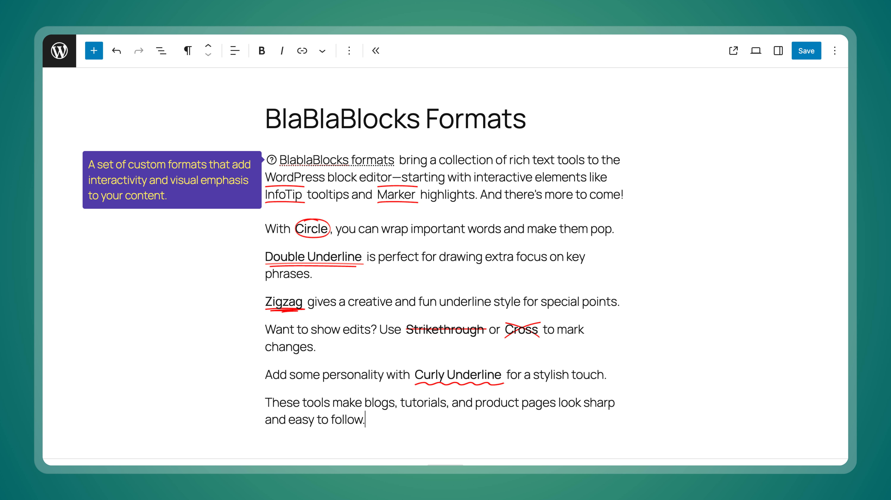

[](https://playground.wordpress.net/?blueprint-url=https://raw.githubusercontent.com/lubusIN/blablablocks-formats/playground/_playground/blueprint-github.json)

## Overview

A collection of rich text formats for the WordPress block editor with interactive elements. Starting with InfoTip tooltips and Marker highlights. More to come in the future!

## Requirements

-   WordPress 6.6+
-   Modern browser with JavaScript enabled
-   Floating UI library (included)

## Installation

1. Download the latest release from GitHub
2. Visit `Plugins > Add New`
3. Upload the `blablablocks-formats.zip` file
4. Activate `BlaBlaBlocks Formats` from plugins page

## Usage

### InfoTip Format

<!-- TODO - add recording -->

1. Select any text in the block editor
2. Click the InfoTip button in the formatting toolbar
3. Configure your tooltip with custom text, colors, and overlay placement

### Marker Format

<!-- TODO - add recording -->

1. Select text you want to highlight
2. Click the Marker button in the formatting toolbar
3. Choose your preferred highlighting style and animation

## Development

### 1. Clone the repository

Clone the repository to your local system:

```bash
git clone git@github.com:lubusIN/blablablocks-formats.git
```

### 2. Go to the plugin folder

```bash
cd blablablocks-formats
```

### 3. Install dependencies

```bash
npm install
```

### 4. Build plugin

Build or start the development environment:

```bash
npm run build       # Compile the source files
# OR
npm run start       # Watch for changes and auto-compile
```

### 5. Launch Playground

```bash
npm run serve
```

## Meet Your Artisans

[LUBUS](http://lubus.in) is a web design agency based in Mumbai.

<a href="https://cal.com/lubus">
	
</a>

## Credits

<a href="https://github.com/lubusIN/blablablocks-formats/graphs/contributors">
  
</a>

-   [Infotip](https://thenounproject.com/icon/tooltip-383461/) icon by [Icon Island](https://thenounproject.com/iconisland) from [Noun Project](https://thenounproject.com/browse/icons/term/tooltip/) (CC BY 3.0)

-   [Marker](https://thenounproject.com/icon/highlighter-7628276/) icon by [Muhammad Nur Auliady Pamungkas](https://thenounproject.com/mnauliady) from [Noun Project](https://thenounproject.com/browse/icons/term/highlighter/) (CC BY 3.0)

## License

BlaBlaBlocks Formats is open-sourced plugin licensed under the [MIT license](LICENSE)
